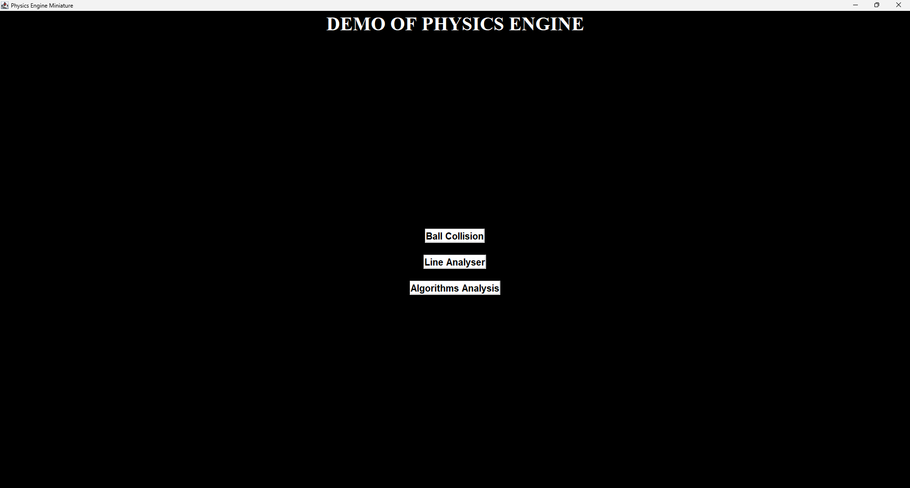
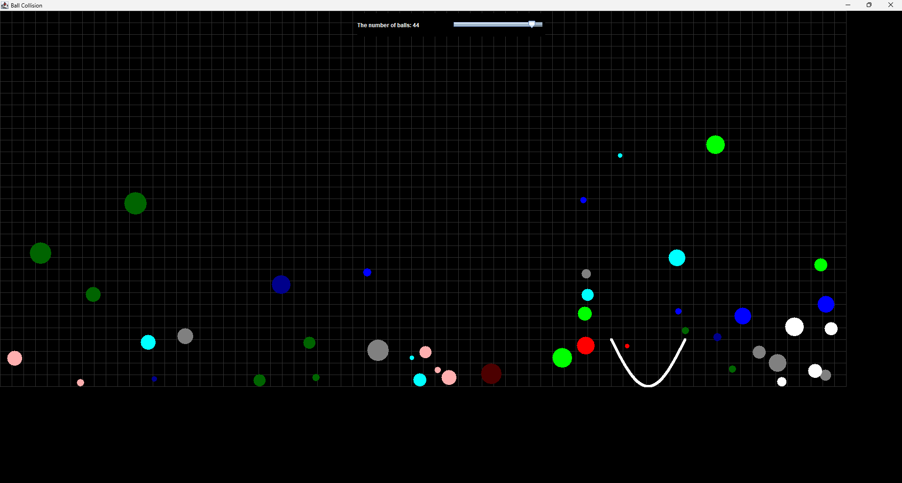
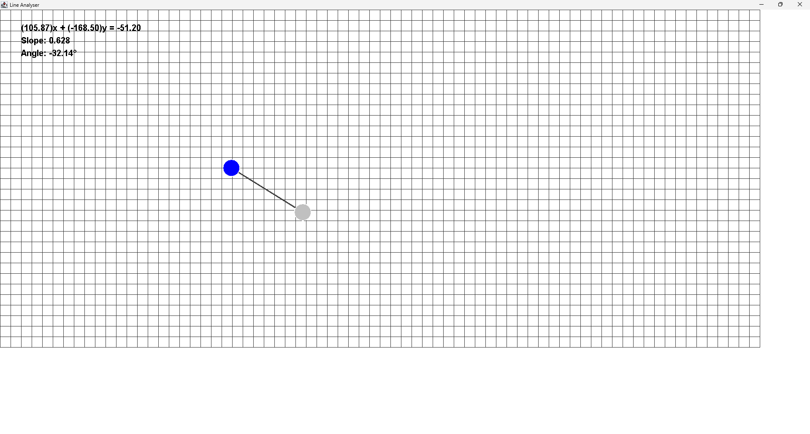
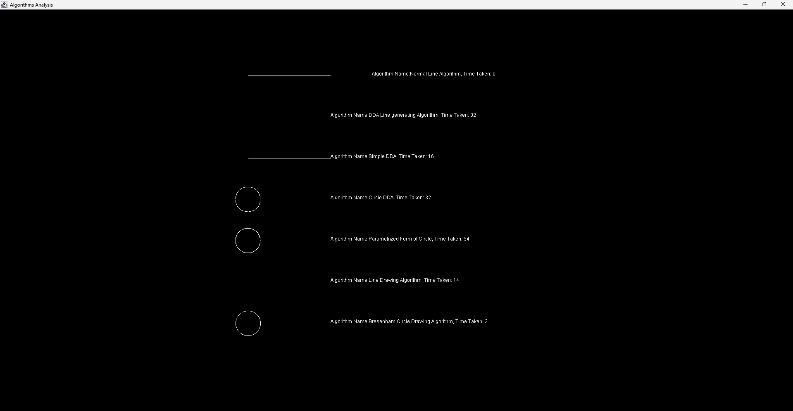
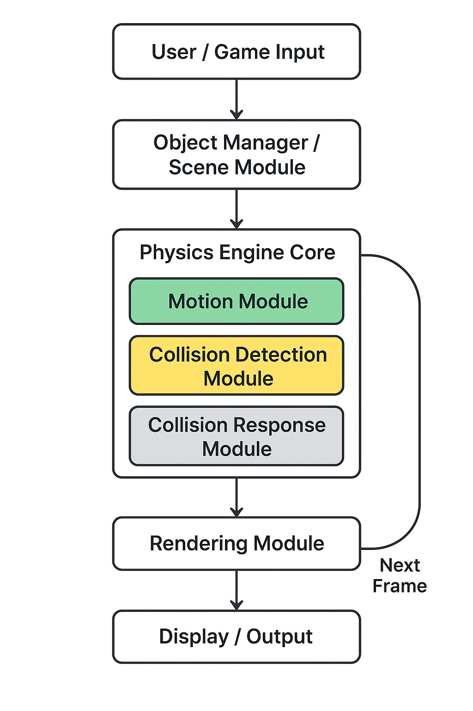

# Visai — A Modular 2D Physics Engine

Visai is a lightweight, Java-based, modular 2D physics engine designed for real-time rigid body simulations and collision dynamics. It’s perfect for learning, prototyping, or building custom physics-driven applications.

---

##  Table of Contents

- [Overview](#overview)
- [Features](#features)
- [Getting Started](#getting-started)
    - [Prerequisites](#prerequisites)
    - [Installation & Build](#installation--build)
- [Usage Example](#usage-example)
- [Project Structure & Architecture](#project-structure---architectural-diagram)

  [//]: # ( - [Running the Visual Demo]&#40;#running-the-visual-demo&#41;)
[//]: # (- [Extensibility]&#40;#extensibility&#41;)

[//]: # (- [Performance Notes]&#40;#performance-notes&#41;)

[//]: # (- [Contributing]&#40;#contributing&#41;)

[//]: # (- [Roadmap]&#40;#roadmap&#41;)

[//]: # (- [License]&#40;#license&#41;)

[//]: # (- [Acknowledgments]&#40;#acknowledgments&#41;)

---

##  Overview

Visai offers a modular framework built in Java for simulating rigid bodies and handling collision dynamics. With separate modules for physics logic and a visual demo, it’s structured for clarity and scalability.

---

##  Features

- **Rigid Body Simulation** — Simulates basic shapes (circles, rectangles, etc.) with realistic motion.
- **Collision Mechanics** — Supports detection and resolution with easily extensible logic.
- **Modular Design** — Clean separation between physics core (`Physics2D`) and demo front-end (`Visual_Demo`).:contentReference[oaicite:3]{index=3}
- **Java-Based** — Compatible with standard Java toolchains and IDEs.
- **Visual Demo Included** — Quick way to see physics in action.

---
## Usage Example
- **Demonstration of an under-development Physics Engine**
</img>
- This is the ball collision window, where you can control the number of balls, still-under development.
</img>
- Using the two point formula, you can find out the inclination and angle of a given line by dragging it and moving it
</img>
- A simple yet almost-useless demonstration of algorithms and their time taken to draw lines and circles.
</img>

---
## Project Structure - Architectural Diagram
</img>
---
##  Getting Started

### Prerequisites

- Java JDK 11 or newer
- Optional: Build tools like Gradle or Maven
- Optional: Any Java-compatible IDE (e.g., IntelliJ IDEA, Eclipse)

### Installation & Build

```bash
git clone https://github.com/SKM6607/Visai--A-2D-Physics-Engine.git
cd Visai--A-2D-Physics-Engine
